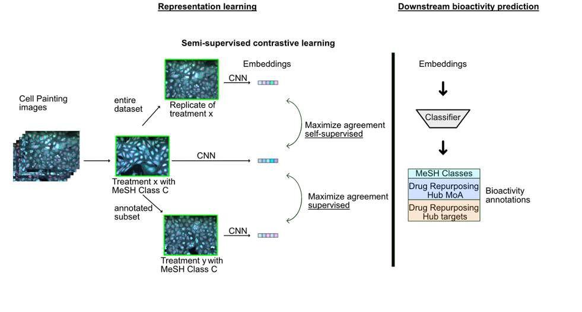
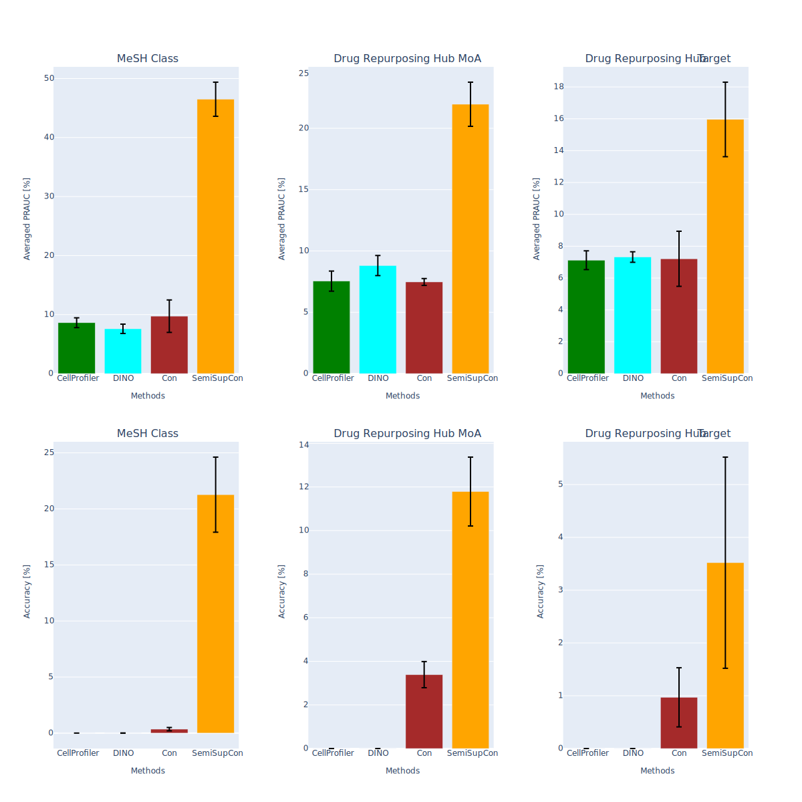

# Semisupervised Contrastive Learning for Bioactivity Prediction Using Cell Painting Image Data

This repo contains the code to reproduce results from our paper [Semisupervised Contrastive Learning for Bioactivity Prediction Using Cell Painting Image Data](https://pubs.acs.org/doi/10.1021/acs.jcim.4c00835#). In this work, we demonstrate the application of SemiSupCon models for extracting meaningful features from Cell Painting data, to facilitate acurate bioactivity prediction. We used the loss functions from the [Supervised Contrastive learning paper](https://arxiv.org/abs/2004.11362).

  

## Baseline comparisson

  

## Data
[SemiSupCon(BBBC022) Embeddings](https://zenodo.org/records/10793843)

[Baseline embeddings for the BBBC022 dataset](https://zenodo.org/records/11204045)

[SemiSupCon(BBBC036) Embeddings](https://zenodo.org/records/11231383)

[BBBC022 images processed with ImageJ](https://zenodo.org/records/10948460)

